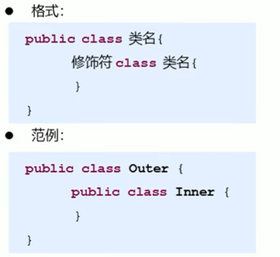
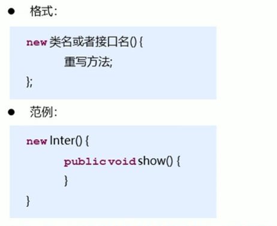

# 内部类

## 1.1内部类概述

内部类：就是在一个类 中定义一个类。举例：在一个类Ad的内部定义一个类B，类B就被称为内部类

内部类的定义格式

内部类的访问特点：

- 内部类可以直接访问外部类的成员，包括私有
- 外部类要访问内部类的成员，必须创建对象

## 1.2 成员内部类

按照内部类在类中定义的位置不同，可以分为如下两种形式

- 在类的成员位置：成员内部类
- 在类的局部位置：局部内部类

成员内部类，外界创建对象使用

- 格式：外部类名.内部类名 对象名 =  new 外部类名.内部类名;
- 范例：Outer.Inner oi = new Outer().new Inner();

当成员内部类是private修饰的时，此时在外界是不能创建对象并使用的，只能在外部类中，创建内部类对象，使用内部类的成员

## 1.3 局部内部类

局部内部类是在方法中定义的类，所以在外界是无法直接使用的，需要在方法内部创建对象并使用。该类可以直接访问外部类的成员，也可以访问方法内的局部变量。

## 1.4 匿名内部类

前提：存在一个类或者接口，这里的类可以是具体类也可以是抽象类

**本质：是一个继承了该类或者实现了该接口的子类匿名对象**